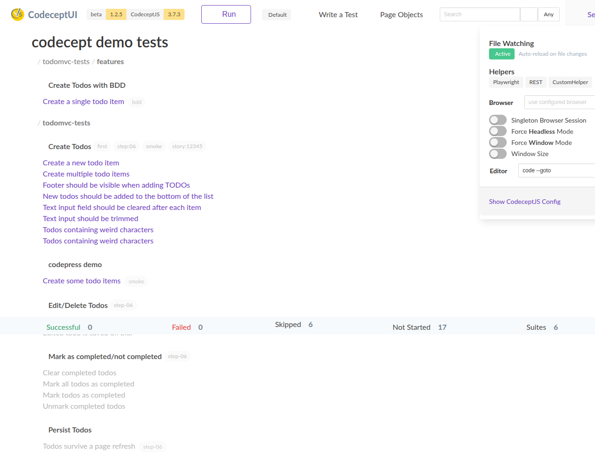
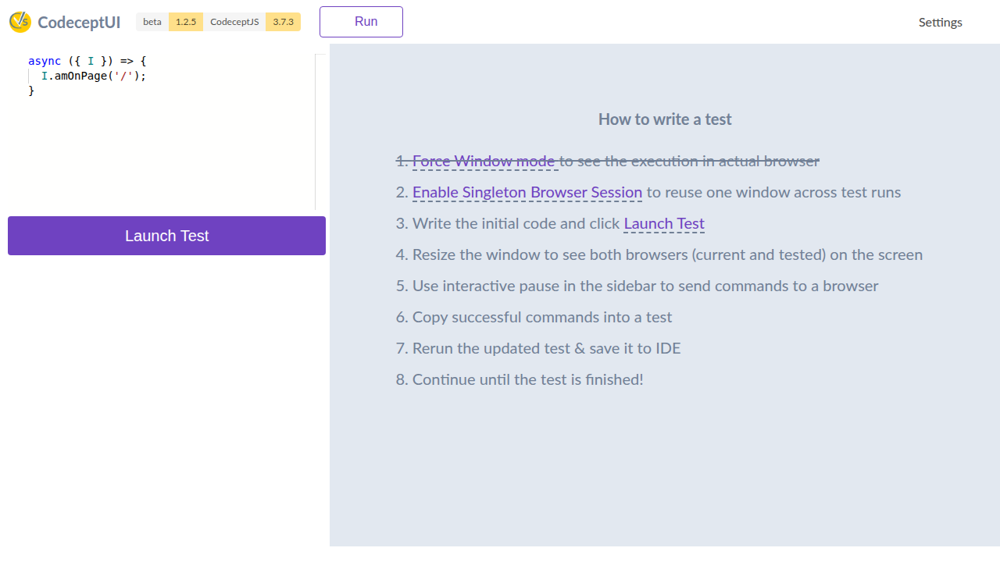
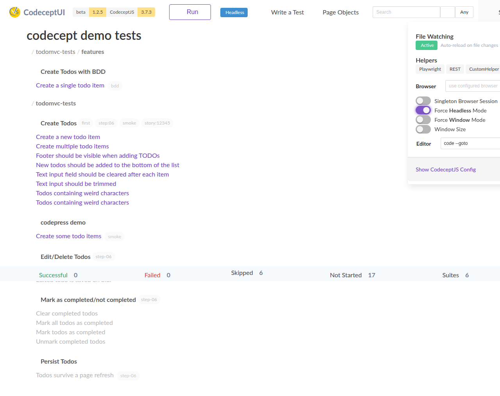
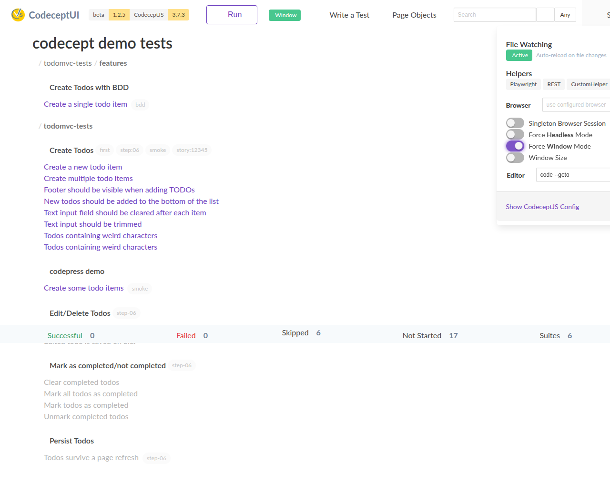
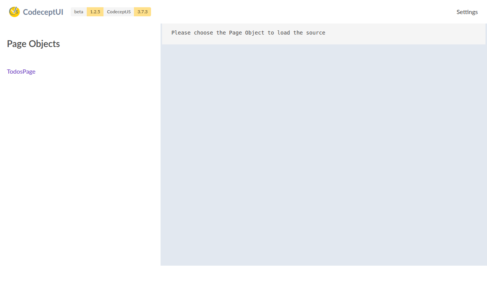

# CodeceptUI

A comprehensive, modern, interactive test development environment for [CodeceptJS](https://codecept.io). 

**Professional IDE-like experience for CodeceptJS test development with comprehensive Monaco Editor integration, real-time file watching, dynamic browser management, and enterprise-grade network compatibility.**



*Enhanced main interface with real-time file watching, runtime mode indicator, and comprehensive test management*

## 🔥 Major New Features

### 💻 Professional Monaco Code Editor Integration
**Full-featured in-browser code editing with modern CodeceptJS 3.x support**


*Professional Monaco Editor with modern CodeceptJS syntax support and intelligent autocompletion*

**Key Editor Features:**
- **Professional IDE Experience**: Full Monaco Editor with syntax highlighting, autocomplete, and real-time validation
- **Modern CodeceptJS 3.x Support**: Updated patterns for Playwright, Puppeteer, WebDriver helpers with `async/await` syntax
- **Smart Autocomplete**: 50+ modern CodeceptJS methods with context-aware suggestions
- **Intelligent Code Parsing**: Reliable scenario extraction using brace matching for accurate editing
- **Auto-backup System**: Automatic file backups with intelligent cleanup (keeps 5 most recent)
- **Real-time File Integration**: Seamless integration with file watching for auto-refresh
- **Security Hardened**: Path traversal protection and file validation
- **Mobile Responsive**: Touch-friendly interface optimized for all device sizes

**Supported Modern CodeceptJS Patterns:**
```javascript
// Modern async/await syntax with full autocomplete support
Scenario('login with modern CodeceptJS', async ({ I }) => {
  await I.amOnPage('/login');
  await I.fillField('email', 'user@example.com');
  await I.click('Login');
  await I.waitForVisible('.dashboard');
  await I.see('Welcome Dashboard');
});

// Data-driven testing support
Data([
  { user: 'admin', password: 'secret' },
  { user: 'guest', password: 'guest123' }
]).Scenario('data-driven login test', async ({ I, current }) => {
  await I.amOnPage('/login');
  await I.fillField('username', current.user);
  await I.fillField('password', current.password);
});

// Modern hooks and configuration
Before(async ({ I }) => {
  await I.amOnPage('/setup');
});

Scenario.only('focused test for debugging', async ({ I }) => {
  // Only this test will run
});
```

### 🌐 Universal Network Compatibility
**Enterprise-grade compatibility with modern development workflows**

- **CORS Support**: Full CORS configuration with environment variable override support
- **Reverse Proxy Compatible**: Works seamlessly behind Traefik, nginx, and other reverse proxies
- **Custom Port Support**: Enhanced support for custom ports with backward compatibility
- **WebSocket Reliability**: Intelligent connection handling with fallback mechanisms

### 🔄 Real-time Development Features


#### File Watching & Auto-refresh
- **Automatic reload** when test scenarios, configuration, or any watched files change
- **Visual indicators** showing file watching status and changes
- **Smart notifications** for file modifications, additions, and deletions
- **Comprehensive monitoring** of test files, config files, and page objects

#### Dynamic Runtime Mode Switching
- **On-the-fly switching** between headless and windowed browser modes
- **Visual mode indicators** in the main toolbar showing current execution mode
- **Persistent settings** that remember your preferences across sessions
- **Easy toggle controls** in the settings menu


*Headless mode indicator and settings*

 
*Window mode indicator and settings*

### 📄 Enhanced Page Objects Management


*Page objects browser with syntax highlighting and source viewing*

- **Visual page object browser** for exploring your test architecture
- **Source code viewer** with Monaco syntax highlighting
- **Easy navigation** between different page objects
- **Integrated editing** capabilities for page object files

### ⚡ Performance & User Experience

**Comprehensive Performance Optimizations:**
- **Debounced search** (300ms) with real-time filtering for large test suites
- **Smart rendering** that only displays matching test scenarios  
- **Optimized WebSocket communication** with intelligent throttling
- **Lazy loading** of heavy dependencies (Monaco Editor loads on demand)
- **Enhanced mobile experience** with responsive design across all devices

**Modern User Interface:**
- **Enhanced visual feedback** with progress indicators and status badges
- **Loading components** with cancellation support
- **Toast notification system** for better user feedback
- **Modern step visualization** with duration badges and status icons


*Page objects browser and source viewer*

## Core Features

### 🎯 Test Execution & Management
* **Multiple Runtime Modes**: Runs as Electron app or web server
* **Flexible Browser Support**: Headless & windowed mode with runtime switching
* **Interactive Development**: Live test writing with pause/resume capabilities
* **Real-time Monitoring**: Comprehensive file watching with visual indicators

### 💻 Professional Code Editing
* **Monaco Editor Integration**: Full IDE experience with syntax highlighting
* **Modern CodeceptJS Support**: Complete support for CodeceptJS 3.x syntax patterns
* **Smart Autocompletion**: 50+ methods with intelligent context awareness
* **Backup & Recovery**: Automatic file backups with cleanup management

### 🌐 Network & Deployment
* **Universal Compatibility**: CORS support, reverse proxy compatible
* **Custom Port Configuration**: Enhanced port handling with legacy support  
* **Enterprise Ready**: Security hardening and path traversal protection
* **WebSocket Reliability**: Intelligent connection handling with fallbacks

### 🎨 Modern User Experience
* **Responsive Design**: Optimized for desktop, tablet, and mobile devices
* **Enhanced Visualizations**: Progress indicators, status badges, and loading states
* **Performance Optimized**: Debounced search, smart rendering, lazy loading
* **Cross-Platform**: Supports all CodeceptJS engines:
  * **Playwright** (recommended)
  * **Puppeteer**
  * **WebDriverIO**
  * **TestCafe**

## 🚀 Advanced Features

### Code Editor API
* **REST API** for programmatic code editing operations
* **Real-time collaboration** capabilities for team development
* **Version control integration** with automatic backup management
* **Security-first approach** with comprehensive input validation

### Browser Management
* **Single Session Helper** with intelligent lifecycle management
* **Resource cleanup** preventing browser process leaks
* **Graceful shutdown** with proper browser termination
* **Multi-helper support** across different automation frameworks

## Quickstart

**Requires [CodeceptJS 3](https://codecept.io) to be installed**

Install CodeceptUI in a project where CodeceptJS is already used

```
npm i @codeceptjs/ui --save
```

### Application Mode

Run CodeceptUI in application mode (recommended for development, local debug):

```
npx codecept-ui --app
```

Uses `codecept.conf.js` config from the current directory. 

If needed, provide a path to config file with `--config` option:

```
npx codecept run --config tests/codecept.conf.js
```

### WebServer Mode


Run CodeceptUI as a web server (recommended for headless mode, remote debug):

```
npx codecept-ui
```

Open `http://localhost:3333` to see all tests and run them.

## 🔧 Technical Achievements & Issues Resolved

### 🎯 Comprehensive GitHub Issues Resolution
This version addresses **10 critical GitHub issues** that were preventing CodeceptUI from working effectively with modern development workflows:

- **Issue #38**: Professional Monaco Editor integration with modern CodeceptJS 3.x syntax support
- **Issue #536**: CORS headers configuration for proper WebSocket connections
- **Issue #125**: Reverse proxy support with intelligent connection handling  
- **Issue #72**: Custom port WebSocket functionality with legacy environment variable support
- **Issue #178**: Configuration hooks processing for @codeceptjs/configure compatibility
- **Issue #104**: Enhanced file watching with comprehensive auto-updates
- **Issue #117**: Run button state management with proper exit event emission
- **Issue #114/#110**: Browser cleanup and resource management improvements
- **Issue #105**: IDE-like split pane view with test code preview
- **Issue #41/#72/#100/#103**: Mobile responsive design and small screen UX enhancements

### 💻 Monaco Editor Architecture
```javascript
// Professional autocomplete with modern CodeceptJS methods
const suggestions = {
  playwright: [
    'I.amOnPage(url)', 'I.click(locator)', 'I.fillField(field, value)',
    'I.waitForVisible(locator, sec)', 'I.grabTextFrom(locator)'
  ],
  structure: [
    'Scenario(\'name\', async ({ I }) => {})',
    'Before(async ({ I }) => {})', 'Data().Scenario(...)'
  ]
};
```

### 🛡️ Enhanced Security & Reliability
- **Path traversal protection** preventing unauthorized file access
- **Input validation** with comprehensive parameter checking
- **Smart scenario parsing** using brace matching (more reliable than full AST)
- **Graceful error handling** with user-friendly error messages

### ⚡ Performance & Quality Assurance
- **118+ comprehensive tests** covering all functionality layers
- **90%+ test coverage** ensuring reliability across Node.js environments
- **Zero breaking changes** with full backward compatibility maintained
- **Enterprise-grade WebSocket architecture** with failover mechanisms


Uses `codecept.conf.js` config from the current directory. 

If needed, provide a path to config file with `--config` option:

```
npx codecept run --config tests/codecept.conf.js
```

#### Enhanced Port Configuration

CodeceptUI now supports flexible port configuration with both modern and legacy environment variables:

```bash
# Modern environment variables (recommended)
export applicationPort=3000
export wsPort=4000
npx codecept-ui --app

# Legacy environment variables (backward compatible)
export PORT=3000
export WS_PORT=4000  
npx codecept-ui --app

# Command line options (highest priority)
npx codecept-ui --app --port=3000 --wsPort=4000
```

#### Network Configuration Examples

**CORS Configuration:**
```bash
# Allow custom origins
export CORS_ORIGIN="https://my-domain.com"
npx codecept-ui
```

**Reverse Proxy Support:**
```nginx
# Nginx configuration example
location /codeceptui/ {
    proxy_pass http://localhost:3333/;
    proxy_http_version 1.1;
    proxy_set_header Upgrade $http_upgrade;
    proxy_set_header Connection 'upgrade';
    proxy_set_header Host $host;
    proxy_cache_bypass $http_upgrade;
    proxy_set_header X-Forwarded-For $proxy_add_x_forwarded_for;
    proxy_set_header X-Forwarded-Proto $scheme;
}
```


## Development

See [CONTRIBUTING.md](.github/CONTRIBUTING.md)


## Start CodeceptUI with debug output

CodeceptUI uses the [debug](https://github.com/debug-js/debug) package to output debug information. This is useful to troubleshoot problems or just to see what CodeceptUI is doing. To turn on debug information do

```
  # verbose: get all debug information
  DEBUG=codeceptjs:* npx codecept-ui 

  # just get debug output of one module
  DEBUG=codeceptjs:codeceptjs-factory npx codecept-ui
```

# Credits

- Originally created by Stefan Huber @hubidu27
- Maintained my @davertmik
- Icons/Logos <a href="https://iconscout.com/icon/code-280" target="_blank">Code Icon</a> by <a href="https://iconscout.com/contributors/elegant-themes">Elegant Themes</a> on <a href="https://iconscout.com">Iconscout</a>

# Contributors

Thanks all for the contributions!

[//]: contributor-faces

<a href="https://github.com/hubidu"></a>
<a href="https://github.com/DavertMik"></a>
<a href="https://github.com/Arhell"></a>
<a href="https://github.com/PeterNgTr"></a>
<a href="https://github.com/avinash360"></a>
<a href="https://github.com/kaflan"></a>
<a href="https://github.com/lukasf98"></a>
<a href="https://github.com/geilix10"></a>
<a href="https://github.com/Teomik129"></a>

[//]: contributor-faces
