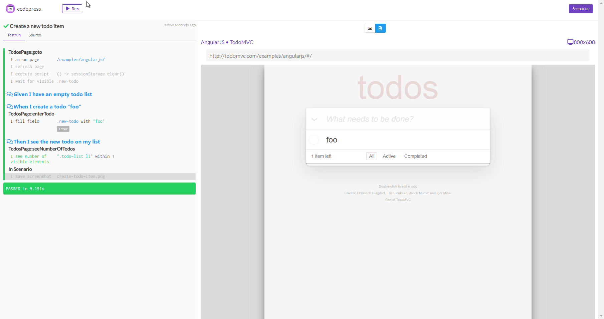

# codepress

An interactive, cypress like test runner for CodeceptJS.



## Quickstart

First install codepress as a global npm package on your system.

```
  npm -g i codepress
```

Now open a terminal and go to your CodeceptJS project. For demonstration purposes you can
use the simple CodeceptJS project provided in the example directory. 
In the root of your CodeceptJS project start codepress:

```
  codepress
```

You should see that codepress is starting and copying some support files (see the _codepress folder) to your project.
Finally codepress will start a webserver:

```
  Initializing codepress...
  Copying support files to _codepress...
  Initialization finished
  Open http://localhost:3001 in your web browser!
```

Opening the specified url should show you a list of the features and scenarios in your project.
Congratulations! You can now select one of the scenarios and watch it run in codepress.

## To be continued...