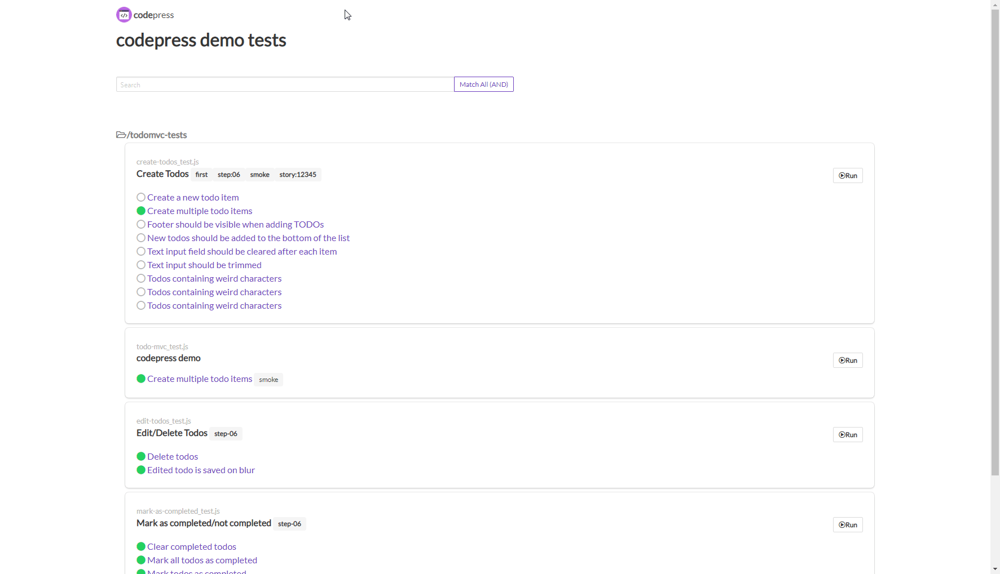

# codepress

An interactive, graphical test runner for CodeceptJS. 


## Quickstart

First install codepress as a global npm package on your system.

```
  npm -g i codepress
```

Now open a terminal and go to your CodeceptJS project. For demonstration purposes you can
use the simple CodeceptJS project provided in the example directory. 
In the root of your CodeceptJS project start codepress:

```
  cd example
  npm install

  codepress
```

You should see that codepress is starting up, finally codepress will start a webserver:

```
  Initializing codepress...
  Initialization finished
  Open http://localhost:3001 in your web browser!
```

When you open the specified url you will see the list of features and scenarios of your CodeceptJS project.
Congratulations! You can now click on one of the scenarios and watch it run in codepress.



## Run with different NODE_ENV

If you want to run your end-2-end tests against different environments you are probably using different configurations depending on the value of the NODE_ENV environment variable. To start codepress with a different value of NODE_ENV do 

```
  NODE_ENV=production codepress # unix
  cross-env NODE_ENV=production codepress # windows
```

Now your CodeceptJS tests should run against the specified environment.

## Start codepress with debug output

codepress uses the debug package to output debug information. This is useful to troubleshoot problems or just to see what codepress is doing. To turn on debug information do

```
  # verbose: get all debug information
  DEBUG=codepress:* codepress 

  # just get debug output of one module
  DEBUG=codepress:codeceptjs-factory codepress
```

# Credits

- Icons/Logos <a href="https://iconscout.com/icon/code-280" target="_blank">Code Icon</a> by <a href="https://iconscout.com/contributors/elegant-themes">Elegant Themes</a> on <a href="https://iconscout.com">Iconscout</a>