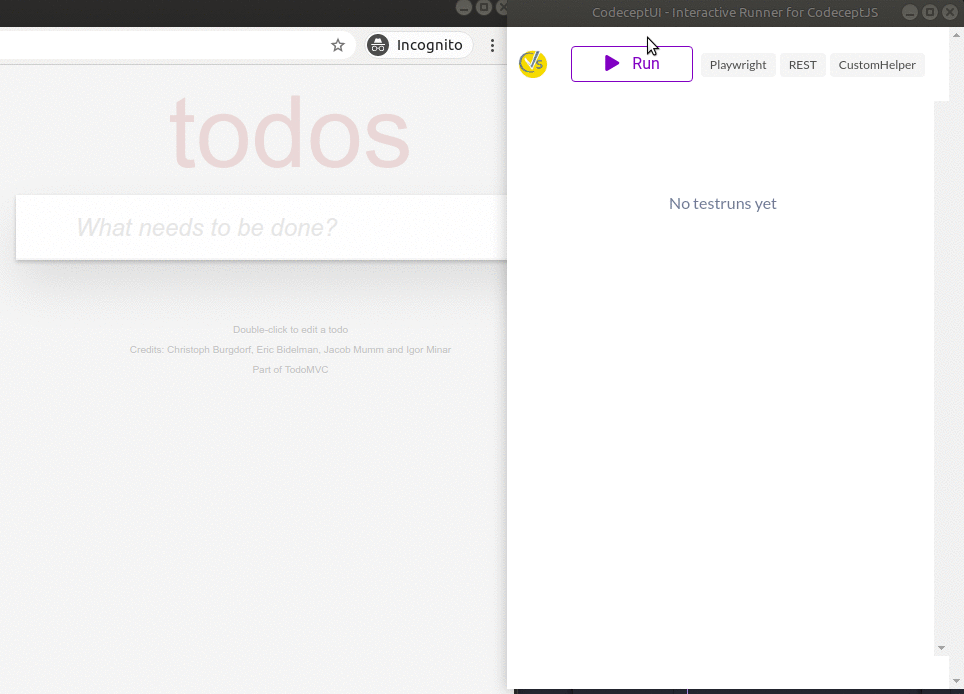

# CodeceptUI

An interactive, graphical test runner for [CodeceptJS](https://codecept.io). 




* Runs as Electron app or as a web server
* Headless & window mode supported
* Test write mode
* Interactive pause built-in
* Snapshots & Time travel
* Runs tests in CodeceptJS supported engines:
  * Playwright
  * Puppeteer
  * webdriverio
  * TestCafe

## Quickstart

**Requires [CodeceptJS 3](https://codecept.io) to be installed**

Install CodeceptUI in a project where CodeceptJS is already used

```
npm i @codeceptjs/ui --save
```

### Application Mode

Run CodeceptUI in application mode (recommended for development, local debug):

```
npx codecept-ui --app
```

Uses `codecept.conf.js` config from the current directory. 

If needed, provide a path to config file with `--config` option:

```
npx codecept run --config tests/codecept.conf.js
```

### WebServer Mode


Run CodeceptUI as a web server (recommended for headless mode, remote debug):

```
npx codecept-ui
```

Open `http://localhost:3333` to see all tests and run them.


Uses `codecept.conf.js` config from the current directory. 

If needed, provide a path to config file with `--config` option:

```
npx codecept run --config tests/codecept.conf.js
```

#### Ports

CodeceptUI requires two ports HTTP and WebSocket. 

* HTTP Port = 3333
* WebSocket Port = 2999

Default HTTP port is 3333. You can change the port by specifying it to **--port** option:

```
npx codecept-ui --app --port=3000
```


Default WebSocket port is 2999. You can change the port by specifying it to **--wsPort** option:
```
npx codecept-ui --app --wsPort=4444
```


## Development

See [CONTRIBUTING.md](.github/CONTRIBUTING.md)


## Start CodeceptUI with debug output

CodeceptUI uses the [debug](https://github.com/debug-js/debug) package to output debug information. This is useful to troubleshoot problems or just to see what CodeceptUI is doing. To turn on debug information do

```
  # verbose: get all debug information
  DEBUG=codeceptjs:* npx codecept-ui 

  # just get debug output of one module
  DEBUG=codeceptjs:codeceptjs-factory npx codecept-ui
```

# Credits

- Originally created by Stefan Huber @hubidu27
- Maintained my @davertmik
- Icons/Logos <a href="https://iconscout.com/icon/code-280" target="_blank">Code Icon</a> by <a href="https://iconscout.com/contributors/elegant-themes">Elegant Themes</a> on <a href="https://iconscout.com">Iconscout</a>

# Contributors

Thanks all for the contributions!

[//]: contributor-faces

<a href="https://github.com/hubidu"></a>
<a href="https://github.com/DavertMik"></a>
<a href="https://github.com/Arhell"></a>
<a href="https://github.com/PeterNgTr"></a>
<a href="https://github.com/avinash360"></a>
<a href="https://github.com/kaflan"></a>
<a href="https://github.com/lukasf98"></a>
<a href="https://github.com/geilix10"></a>
<a href="https://github.com/Teomik129"></a>

[//]: contributor-faces
